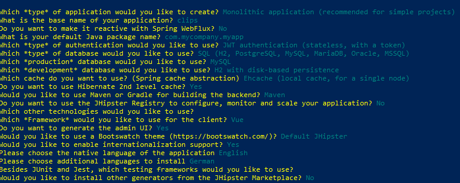
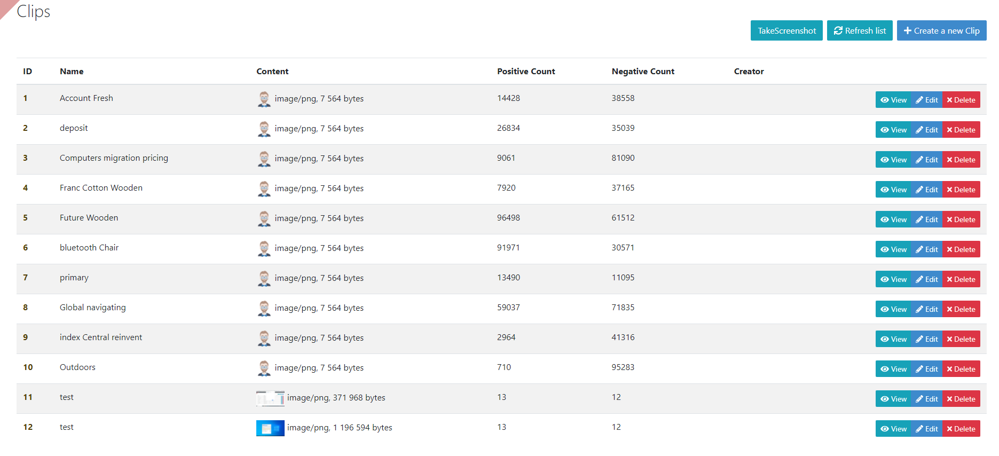
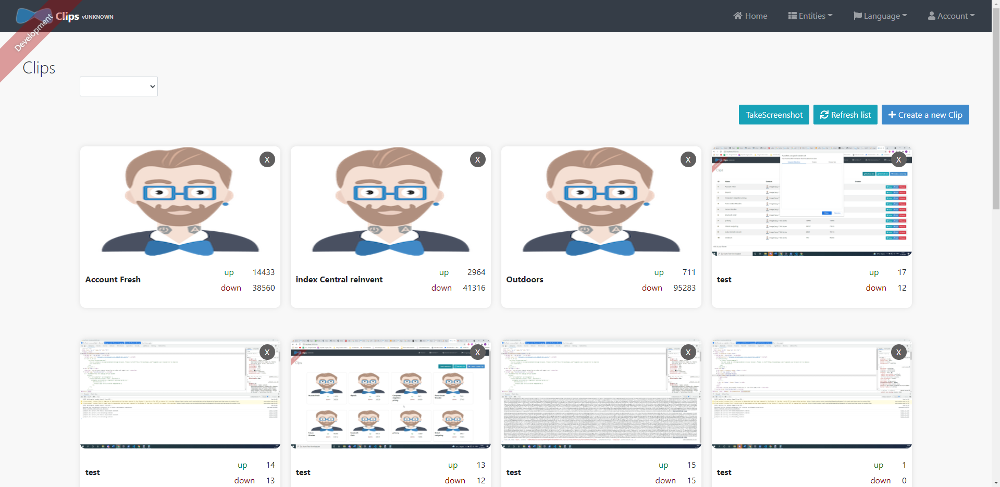
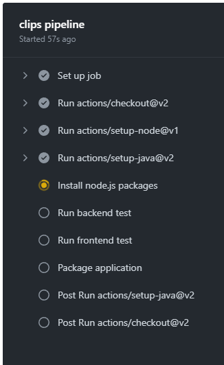

# clips

# Was ist jhipster?
Jhipster ist ein Open Source Anwendungsgenerator. Im Backend kommt hierbei das Java Spring Framework zum Einsatz. Das Frontend kann entweder mit Angular, React oder Vue entwickelt werden. Außerdem können noch viele weitere Konfigurationen durchgeführt werden. Darunter fallen unter anderem:

* Tests
* Security
* Verwendete Datenbank
* generelle Struktur der Anwendung

# Projektarbeit
Das Ziel dieser Projektarbeit ist das Testen von JHipster und einige der verfügbaren Konfigurationen anhand eines einfachen Beispiels. Dabei soll eine Anwendungen entwickelt werden, die Screenshots des Bildschirms aufnehmen kann und daraus eine Galerie erstellt. Die einzelnen Galerieelemente können von mehreren Usern eingesehen und bewertet werden. Die Bewertung erfolgt entweder durch einen Up-Vote oder durch einen Down-Vote. Im weiteren Verlauf der Dokumentation werden die verschiedenen Entwicklungsschritte der Applikation näher erläutert und es wird darauf eingegangen, wie Jhipster das Ganze unterstützt.

# Konfiguration
Zu Beginn kann mittels des Befehls "jhipster" in der Kommandozeile eine neue Applikation generiert werden. Darauf folgen einige Fragen bezüglich der Konfiguration der Applikation. Auf dem folgenden Bild kann die für diese Anwendung gewählte Konfiguration eingesehen werden. 



# Entitäten generieren
Um Entitäten zu generieren bietet JHipster zwei Möglichkeiten. Zum einen kann das sogenannte "Jdlstudio" verwendet werden. Es ermöglicht mit Hilfe einer JSON ähnlichen Notation Entitäten und deren Relationen zueinander zu modellieren. Diese Modellierung ist visuell als Graph einsehbar. Weiterhin ist das Importieren und Exportieren der Notationen möglich. Das exportierte File kann schließlich mit dem Befehl "jhipster jdl my_file.jdl" in das erstellte Projekt importiert werden.


Die zweite Möglichkeit ist es, die Entitäten über die Kommandozeile zu erstellen. Dies geschieht durch den Befehl "jhipster entity myEntity". Hier werden ähnlich wie bei der Konfiguration während der JHipster Projekterstellung einige Fragen gestellt, wie die Entität generiert werden soll.

Bei beiden Möglichkeiten werden die Entitäten komplett erstellt. Es werden Tabellen in der Datenbank angelegt, Services im Backend registriert, die CRUD Operationen für die Entitäten ermöglichen und die Entitäten können mit Beispieldaten versehen, im Frontend in Tabellenform angezeigt werden.

## Besonderheiten
### User Entität
Standardmäßig werden zwei Benutzer automatisch angelegt. Ein User und ein Admin. Somit muss eine User Entität existieren, die aber speziell behandelt wird. Jhipster gibt drei Möglichkeiten an, um User Entitäten anzupassen.

* 1 zu 1 Beziehung auf die bestehende User Entity, um diese zu erweitern.
* Vererbung
* User Entity manuell anlegen

JHipster empfiehlt die erste Möglichkeit. Aus diesem Grund wird die 1 zu 1 Beziehung auf die bestehende User Entity in diesem Projekt angewendet. Mehr zu User Entitäten kann hier nachgelesen werden: https://www.jhipster.tech/user-entity/

### Bearbeiten von Entitäten
Werden an den standardmäßig generierten Anzeige der Entitäten und an den Entitäten selbst nächträglich Veränderungen vorgenommen, werden bei der wiederholten Generierung alle Änderungen überschrieben. Deshalb sollte schon von Beginn an sicher gestellt werden, wie die Entitäten modelliert werden sollen.

# Frontend Anpassungen
Im Frontend wird die Anzeige der Entitäten überarbeitet. Anstatt einer Tabellenform sollen die Bilder nebeneinander in Kachelform mit Namen und Up- bzw. Down-Vote Möglichkeiten angezeigt werden. Hier ein Vorher und nachher Vergleich der beiden Ansichten:



Zusätzlich wird ein Button hinzugefügt, über den ein Screenshot des Bildschirms aufgenommen werden kann. Sind mehrere Bildschirme vorhanden, ist eine Auswahl möglich. Das aufgenommene Bild wird dem aktuellen Nutzer hinzugefügt und in der Kachelansicht dargestellt.

# Backend Anpassungen
Im Backend mussten folgenden Anpassungen vorgenommen werden:
    - API Erweiterungen
    - Validierung der Bewertungen (nur ein mal pro Benutzer)
    - Automatisches ergänzen des Erstellers

# Mehrsprachigkeiten

# Tests
Standardmäßig verwendet JHipster JUnit (Unit tests) und Jest (UI). Die Tests können durch "./mvnw clean verify" und "npm test" ausgeführt werden. Beim Generieren der Applikation hat man die Möglichkeit weitere Testframeworks zu verwenden. In diesem Projekt wurde sich jedoch auf die standard Frameworks beschränkt. Nach dem Generieren der Applikation wurde schon diverse Frontend und Backend Tests implementiert.

# Continious Integration
Um eine CI zu integrieren kann folgender Befehl im Projektorder ausgeführt werden:

jhipster ci-cd

Anschließend folgt eine Abfrage, welche Pipeline verwendet werden soll. Folgende Möglichkeiten bieten sich:

* Jenkins
* Travis
* GitLab CI
* Azure Pipelines
* GitHub Actions

In diesem Projekt soll GitHub Actions verwendet werden und wird dementsprechend ausgewählt. Anschluss wird im Projektordner ein yaml-Konfigurationsfile erstellt. Von nun an werden bei jedem Push Github Actions ausgeführt, die Sicherstellen dass die Applikation kompiliert und die Tests alle durch laufen. Folgende Abbildung zeigt das Ergebnis:



# deployment
Um ein Prod build mit Maven zu testen muss folgender Befehl ausgeführt werden:

./mvnew -Pprod

Dies kompiliert, testet und verpackt die Anwendung mit allen Production-Settings. War der Test erfolgreich, kann die Applikation mit Docker deployed werden. Um ein Docker-Image zu erstellen und in die Docker-Registry mit aufzunehmen, kann folgender Befehl ausgeführt werden:

./mvnw package -Pprod verify jib:dockerBuild

Um das Image auszuführen, kann Docker Compose mit der erstellten Konfiguration ausgeführt werden. Diese befindet sich in src/main/docker. 

docker-compose -f src/main/docker/app.yml up

# Fazit
Abschließend lässt sich sagen, dass Jhipster ein mächtiges Tool ist, um schnell einen ersten Stand einer Anwendung zu entwickeln. Es bietet viele Konfigurationsmöglichkeiten um die verwendeten Technologien auf jeden Anwendungsfall abstimmen zu können. Zusätzlich werden viele Hilfestellungne bereitgestellt, um den Einstieg in die Webentwicklung weiter zu vereinfachen. Außerdem lassen sie die Generatoren anpassen, wodurch der Generierte Code wirklich an jedem Anwendungsfall angepasst werden kann. Noch während dieser Projektarbeit konnte ich mehrmals die Jhipster Version upgrade, was zeigt, dass weiterhin stark daran weiterentwickelt wird und es bleibt spannend welche Features Jhipster in Zukunft noch unterstützen wird.

# AUTO GENERATED DOCUMENTATION

This application was generated using JHipster 7.3.0, you can find documentation and help at [https://www.jhipster.tech/documentation-archive/v7.3.0](https://www.jhipster.tech/documentation-archive/v7.3.0).

## Development

Before you can build this project, you must install and configure the following dependencies on your machine:

1. [Node.js][]: We use Node to run a development web server and build the project.
   Depending on your system, you can install Node either from source or as a pre-packaged bundle.

After installing Node, you should be able to run the following command to install development tools.
You will only need to run this command when dependencies change in [package.json](package.json).

```
npm install
```

We use npm scripts and [Webpack][] as our build system.

Run the following commands in two separate terminals to create a blissful development experience where your browser
auto-refreshes when files change on your hard drive.

```
./mvnw
npm start
```

Npm is also used to manage CSS and JavaScript dependencies used in this application. You can upgrade dependencies by
specifying a newer version in [package.json](package.json). You can also run `npm update` and `npm install` to manage dependencies.
Add the `help` flag on any command to see how you can use it. For example, `npm help update`.

The `npm run` command will list all of the scripts available to run for this project.

### PWA Support

JHipster ships with PWA (Progressive Web App) support, and it's turned off by default. One of the main components of a PWA is a service worker.

The service worker initialization code is commented out by default. To enable it, uncomment the following code in `src/main/webapp/index.html`:

```html
<script>
  if ('serviceWorker' in navigator) {
    navigator.serviceWorker.register('./service-worker.js').then(function () {
      console.log('Service Worker Registered');
    });
  }
</script>
```

Note: [Workbox](https://developers.google.com/web/tools/workbox/) powers JHipster's service worker. It dynamically generates the `service-worker.js` file.

### Managing dependencies

For example, to add [Leaflet][] library as a runtime dependency of your application, you would run following command:

```
npm install --save --save-exact leaflet
```

To benefit from TypeScript type definitions from [DefinitelyTyped][] repository in development, you would run following command:

```
npm install --save-dev --save-exact @types/leaflet
```

Then you would import the JS and CSS files specified in library's installation instructions so that [Webpack][] knows about them:
Note: There are still a few other things remaining to do for Leaflet that we won't detail here.

For further instructions on how to develop with JHipster, have a look at [Using JHipster in development][].

### JHipster Control Center

JHipster Control Center can help you manage and control your application(s). You can start a local control center server (accessible on http://localhost:7419) with:

```
docker-compose -f src/main/docker/jhipster-control-center.yml up
```

## Building for production

### Packaging as jar

To build the final jar and optimize the clips application for production, run:

```
./mvnw -Pprod clean verify
```

This will concatenate and minify the client CSS and JavaScript files. It will also modify `index.html` so it references these new files.
To ensure everything worked, run:

```
java -jar target/*.jar
```

Then navigate to [http://localhost:8080](http://localhost:8080) in your browser.

Refer to [Using JHipster in production][] for more details.

### Packaging as war

To package your application as a war in order to deploy it to an application server, run:

```
./mvnw -Pprod,war clean verify
```

## Testing

To launch your application's tests, run:

```
./mvnw verify
```

### Client tests

Unit tests are run by [Jest][]. They're located in [src/test/javascript/](src/test/javascript/) and can be run with:

```
npm test
```

For more information, refer to the [Running tests page][].

### Code quality

Sonar is used to analyse code quality. You can start a local Sonar server (accessible on http://localhost:9001) with:

```
docker-compose -f src/main/docker/sonar.yml up -d
```

Note: we have turned off authentication in [src/main/docker/sonar.yml](src/main/docker/sonar.yml) for out of the box experience while trying out SonarQube, for real use cases turn it back on.

You can run a Sonar analysis with using the [sonar-scanner](https://docs.sonarqube.org/display/SCAN/Analyzing+with+SonarQube+Scanner) or by using the maven plugin.

Then, run a Sonar analysis:

```
./mvnw -Pprod clean verify sonar:sonar
```

If you need to re-run the Sonar phase, please be sure to specify at least the `initialize` phase since Sonar properties are loaded from the sonar-project.properties file.

```
./mvnw initialize sonar:sonar
```

For more information, refer to the [Code quality page][].

## Using Docker to simplify development (optional)

You can use Docker to improve your JHipster development experience. A number of docker-compose configuration are available in the [src/main/docker](src/main/docker) folder to launch required third party services.

For example, to start a mysql database in a docker container, run:

```
docker-compose -f src/main/docker/mysql.yml up -d
```

To stop it and remove the container, run:

```
docker-compose -f src/main/docker/mysql.yml down
```

You can also fully dockerize your application and all the services that it depends on.
To achieve this, first build a docker image of your app by running:

```
./mvnw -Pprod verify jib:dockerBuild
```

Then run:

```
docker-compose -f src/main/docker/app.yml up -d
```

For more information refer to [Using Docker and Docker-Compose][], this page also contains information on the docker-compose sub-generator (`jhipster docker-compose`), which is able to generate docker configurations for one or several JHipster applications.

## Continuous Integration (optional)

To configure CI for your project, run the ci-cd sub-generator (`jhipster ci-cd`), this will let you generate configuration files for a number of Continuous Integration systems. Consult the [Setting up Continuous Integration][] page for more information.

[jhipster homepage and latest documentation]: https://www.jhipster.tech
[jhipster 7.3.0 archive]: https://www.jhipster.tech/documentation-archive/v7.3.0
[using jhipster in development]: https://www.jhipster.tech/documentation-archive/v7.3.0/development/
[using docker and docker-compose]: https://www.jhipster.tech/documentation-archive/v7.3.0/docker-compose
[using jhipster in production]: https://www.jhipster.tech/documentation-archive/v7.3.0/production/
[running tests page]: https://www.jhipster.tech/documentation-archive/v7.3.0/running-tests/
[code quality page]: https://www.jhipster.tech/documentation-archive/v7.3.0/code-quality/
[setting up continuous integration]: https://www.jhipster.tech/documentation-archive/v7.3.0/setting-up-ci/
[node.js]: https://nodejs.org/
[npm]: https://www.npmjs.com/
[webpack]: https://webpack.github.io/
[browsersync]: https://www.browsersync.io/
[jest]: https://facebook.github.io/jest/
[leaflet]: https://leafletjs.com/
[definitelytyped]: https://definitelytyped.org/
